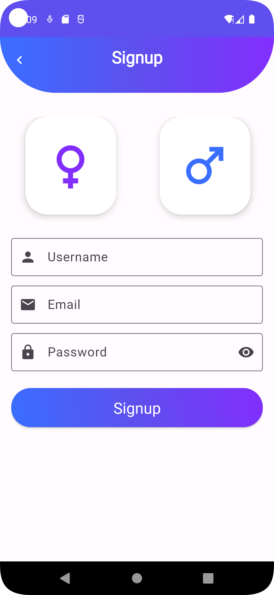
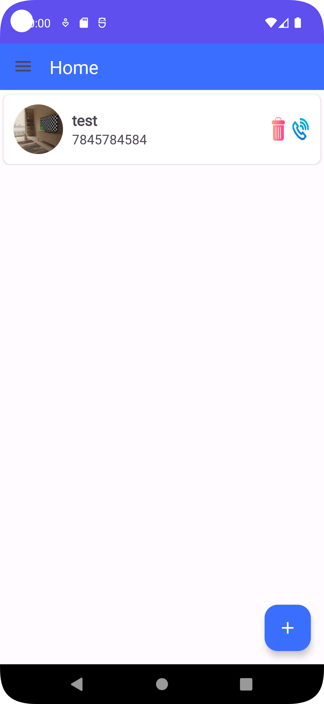
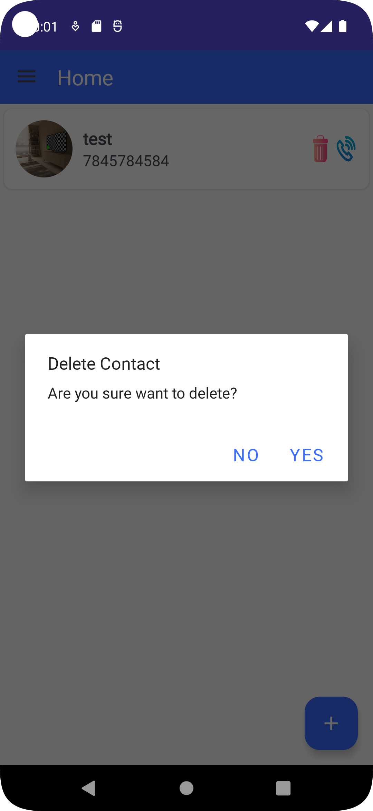
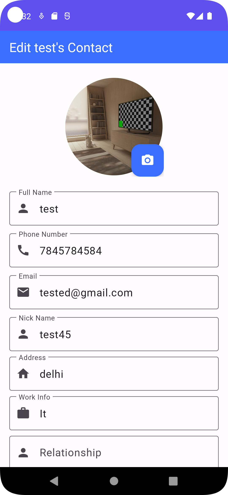
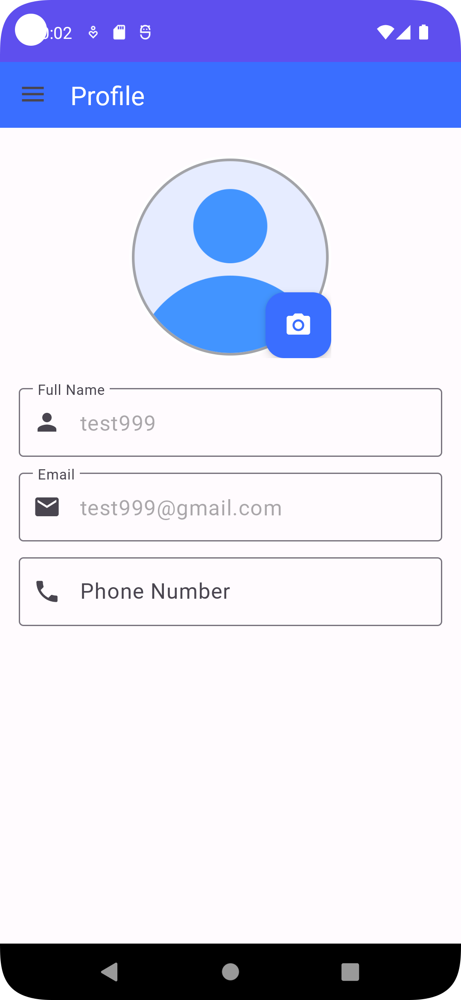
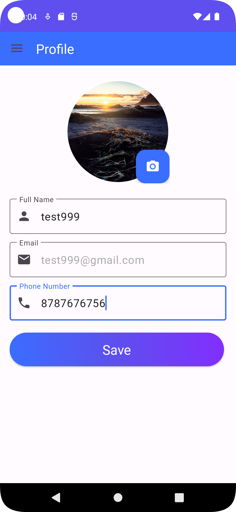
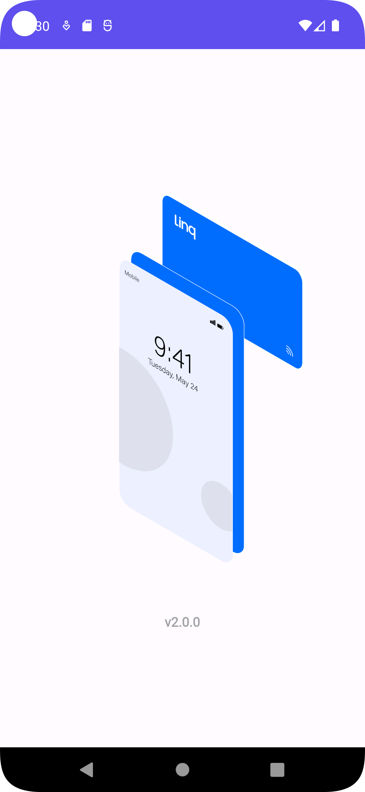
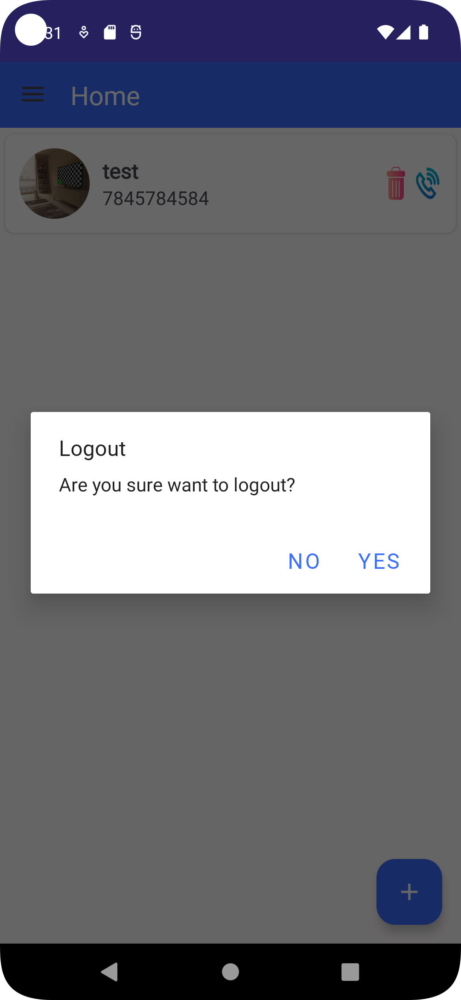
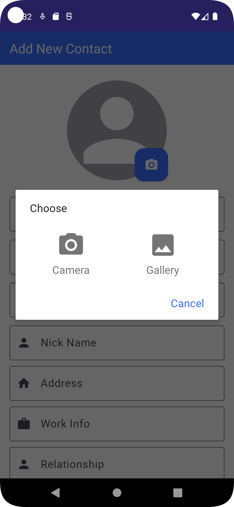

# Telephone Directory app
This project is implemented using JAVA Language. (Android - Flamingo)

## Tech Set
- Language - Java
- Database - SQLITE
- Android Version - Flamingo
- App Version - 1.0.0

## Developer Details
- Neha Pandey (Associate Developer)

## Project Details
- Started on : 11 ‎June ‎2023, ‏‎20:26:35
- Completion on : On Going

### Images 
  
  
  
  